# How Workout Tracker works

A simple log for strength training: what you lifted, how many reps and sets, and
on which day. It's built for a phone at the gym, and it shows you what you did
last time so you know what to aim for.

There are no timers, programs or coaching. You log; it remembers and charts.

- [The idea in 30 seconds](#the-idea-in-30-seconds)
- [Getting started](#getting-started)
- [Routines](#routines)
- [Logging](#logging)
- [Exercises](#exercises)
- [Stats](#stats)
- [Settings and accounts](#settings-and-accounts)
- [Good to know](#good-to-know)

## The idea in 30 seconds

Every time you do an exercise, you save one line: **sets × reps @ weight**, on
a day. For example, *3 × 8 @ 135 lb* on Monday. Next time you open that
exercise, the form is already filled in with what you did last time; change what's
different (say, 140 lb) and save.

Group the exercises you always do together into **routines** (like "Push" or
"Lower 1"), and at the gym just open the routine and tap through the list.

## Getting started

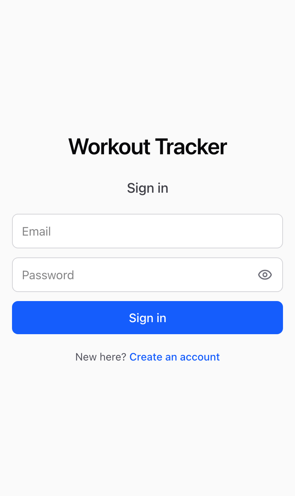

Open the app in your phone's browser and tap **Create an account** under the
sign-in form. Enter your email and tap **Continue**. Sign-up is invite-only, so the
app checks your email first:

- **You're on the list:** choose a password (8+ characters; your phone can
  suggest one) and tap **Create account**.
- **You're not on the list yet:** you're asked to **Request access** instead. Add a
  note saying who you are, and once the owner approves it, come back and create
  your account.
- **You already have an account:** you're sent to **Sign in**.

To use it like an app, add it to your home screen: in Safari, tap **Share →
Add to Home Screen**. It opens full screen, with its own icon, and stays signed
in for a year.

The app has four tabs along the bottom: **Routines**, **Log**, **Stats** and
**Settings**. Each tab remembers the screen you were on; tap the tab again to go
back to its first screen.

 

## Routines

A routine is a named list of exercises you do together, in the order you do
them.

<table>
  <tr>
    <td>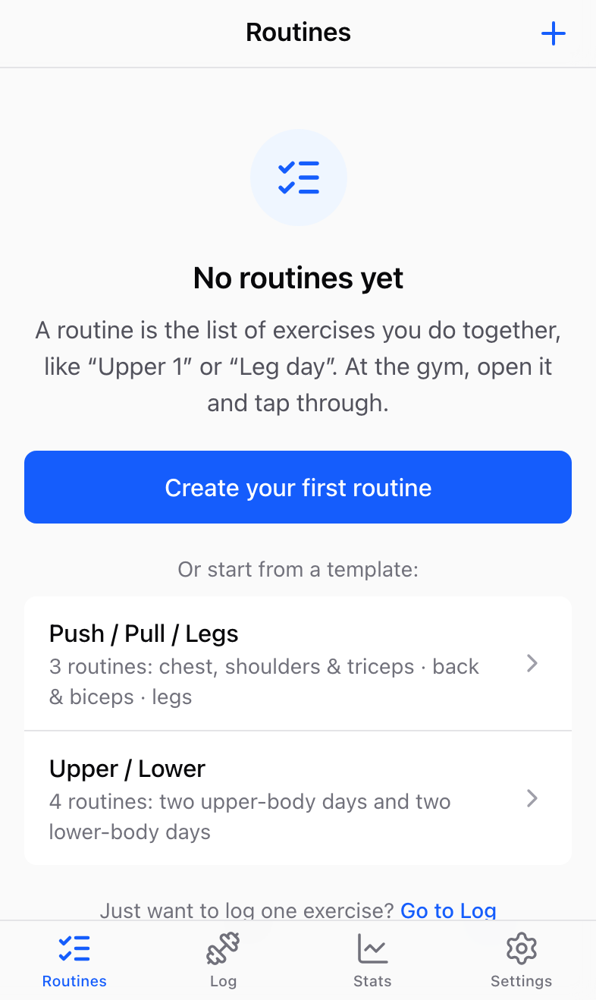</td>
    <td>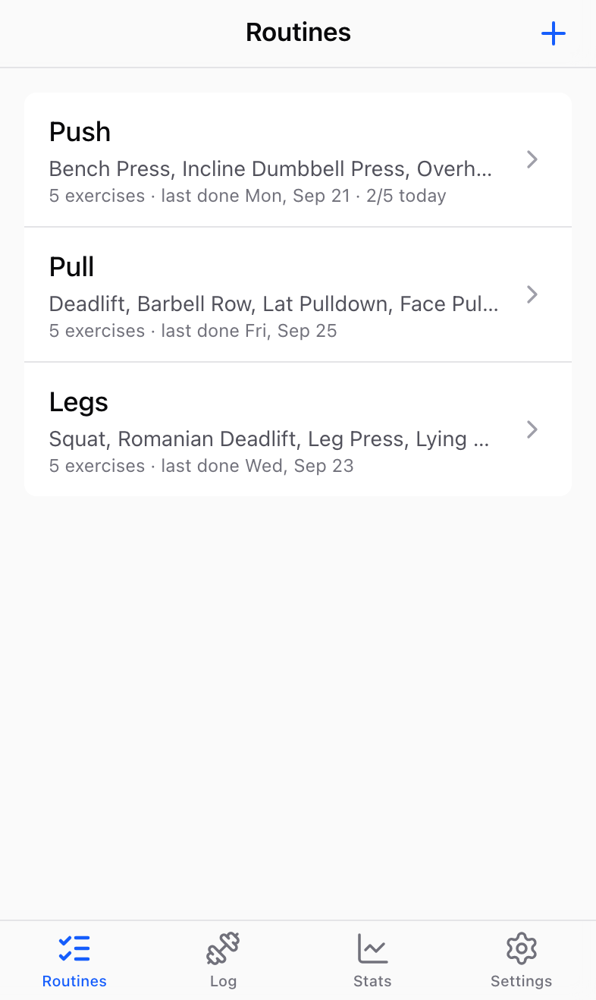</td>
    <td>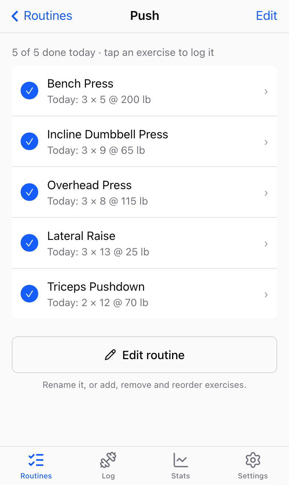</td>
  </tr>
  <tr>
    <td>Starting out: make one, or pick a template.</td>
    <td>Your routines, with their exercises and when you last did each.</td>
    <td>Tap one at the gym. Each exercise shows what you did last time.</td>
  </tr>
</table>

- **Start from a template** to get going quickly: **Push / Pull / Legs**
  (3 routines) or **Upper / Lower** (4 routines), filled with common exercises.
  Tapping one shows exactly which routines and exercises it adds; tap **Add these
  routines** to add them, then edit them however you like. Templates are on the
  empty Routines screen and under **+**.
- **Or create one yourself** with **+** (or **Create your first routine**), then
  add exercises: search, and tap each one.
- **The list** shows each routine's exercises and when you **last did it**, so you
  can see which one is due. A routine counts as done on a day when you logged at
  least half of its exercises. If you've started it today, you'll see "2/5 today".
- **At the gym**, open the routine and tap an exercise to log it. Once you've
  logged something for it today, it gets a ✓, and the routine shows "2 of 5 done
  today". There's nothing to tick by hand, and it resets automatically the next
  day.
- **Edit routine** (the button under the list, or **Edit** at the top right) to
  rename the routine, reorder exercises with ↑ ↓, remove them with ✕, add more,
  or delete the routine. Changes save immediately.
  Deleting a routine never deletes what you've logged.
- The same exercise can be in several routines (Squat in both "Lower 1" and
  "Lower 2", say).

<table>
  <tr>
    <td>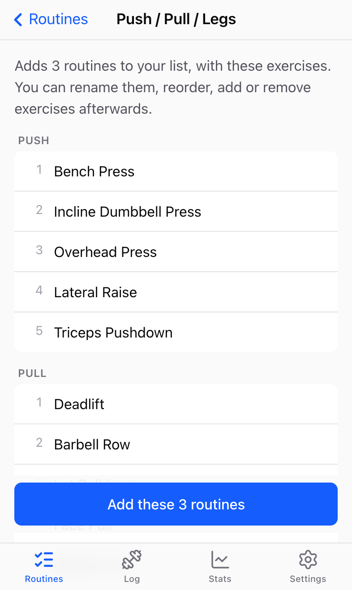</td>
    <td>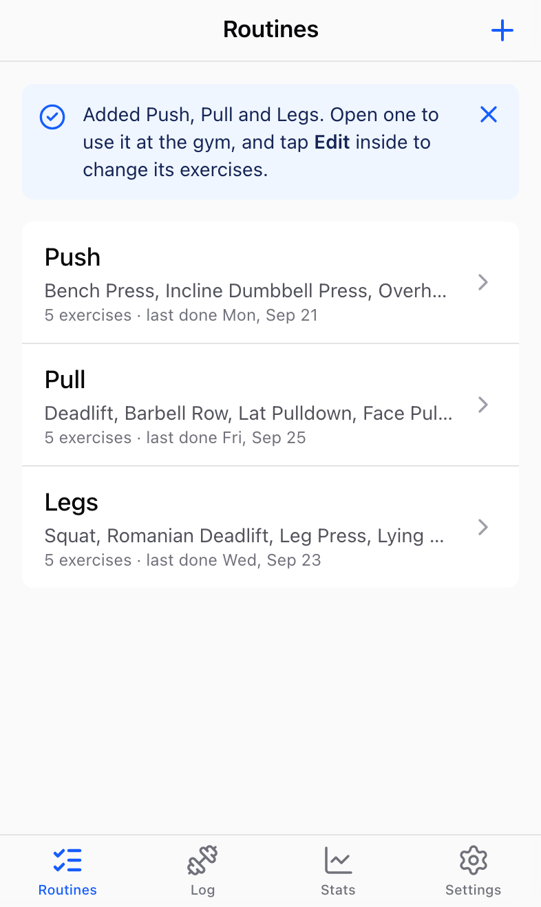</td>
    <td>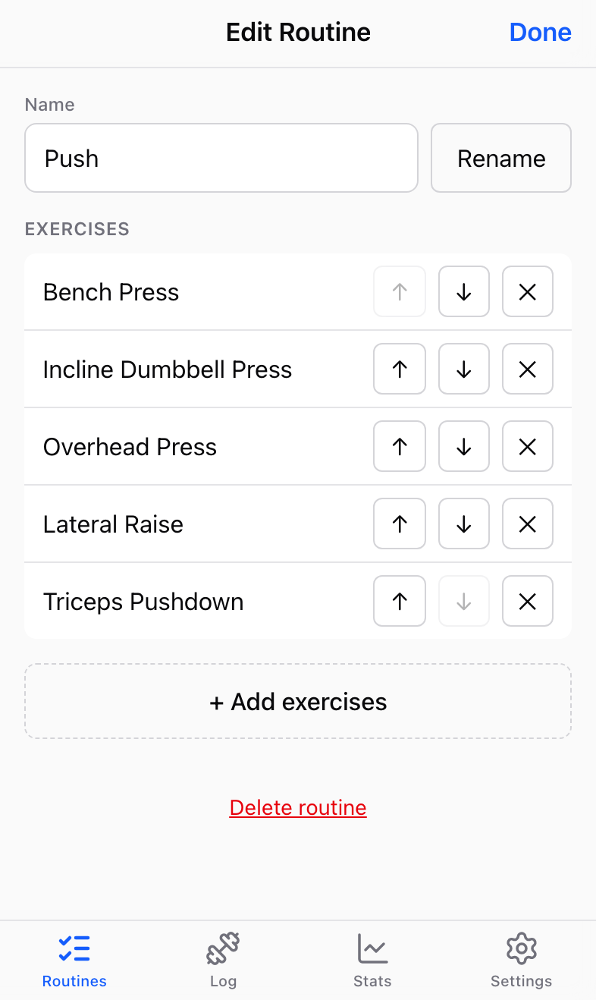</td>
  </tr>
  <tr>
    <td>A template shows what it adds first.</td>
    <td>Then confirms what was added.</td>
    <td>Edit any routine to make it yours.</td>
  </tr>
</table>

## Logging

<table>
  <tr>
    <td>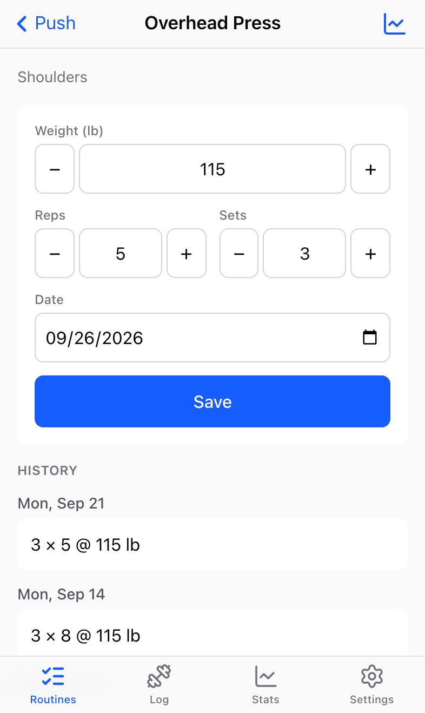</td>
    <td></td>
    <td>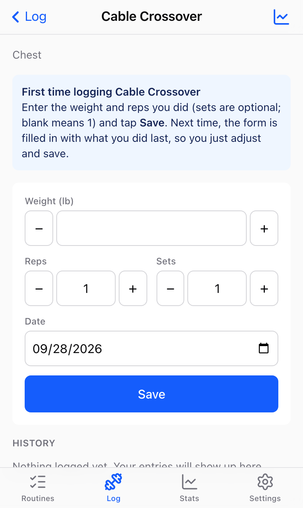</td>
  </tr>
  <tr>
    <td>The form is pre-filled from last time; history is below.</td>
    <td>After saving: on to the next exercise, done, or log another.</td>
    <td>The first time, a note explains what to do.</td>
  </tr>
  <tr>
    <td>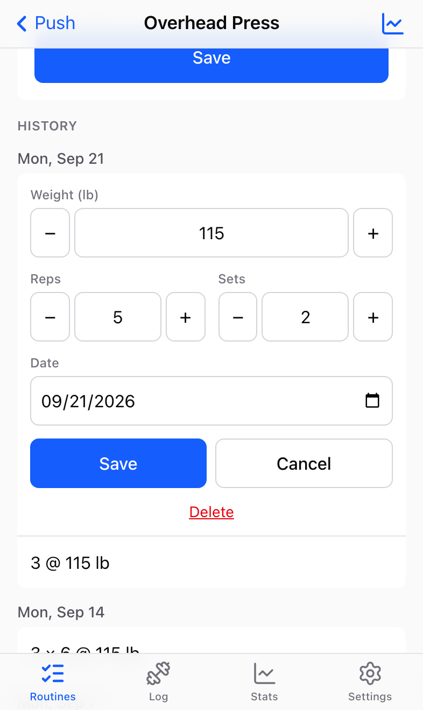</td>
  </tr>
  <tr>
    <td>Tap any past entry to fix or delete it.</td>
  </tr>
</table>

Open an exercise from a routine or from the **Log** tab. The Log tab lists your
**Recent** exercises at the top, with what you did last, so the ones you do
often are one tap away. You get:

- **The form**, pre-filled with your most recent entry. The first time you log an
  exercise, a short note explains what to enter. Use − / + to adjust
  (weight moves in 5 lb steps, reps and sets by 1) or type any value, like
  137.5. Reps and sets start at 1 and never go below it.
- **The date**, which defaults to today on your phone. Change it to log
  something you forgot.
- **History**, newest day first. If a day has more than one entry (say
  *2 × 8* then a weaker *1 × 6*), they're listed in the order you logged them.

Tap **Save** and the form gives way to a confirmation ("Logged 3 × 8 @ 135 lb"),
and the entry appears at the top of the history. From there:

- **Next: <exercise>** (when you came from a routine) opens the next exercise in
  the routine you haven't logged today, so you can work through a whole routine
  without going back to the list.
- **Done** goes back to the routine, or to the Log tab.
- **Log another** brings the form back, pre-filled with what you just saved, for
  another set at a different weight or reps.

Tap any history line to edit or delete it.

The chart icon at the top right jumps to that exercise's stats.

Weights are in pounds.

## Exercises

<table>
  <tr>
    <td>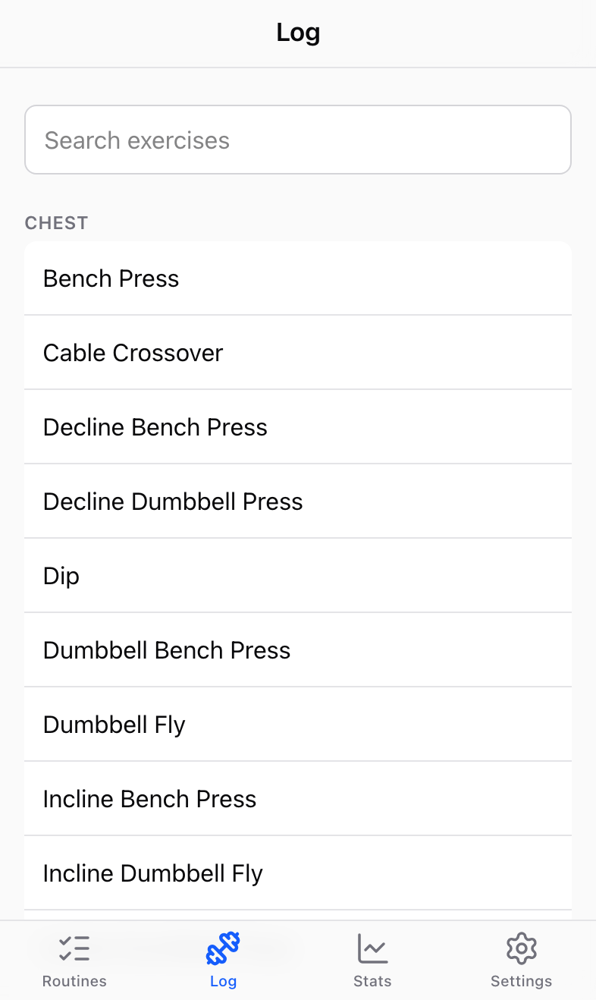</td>
    <td>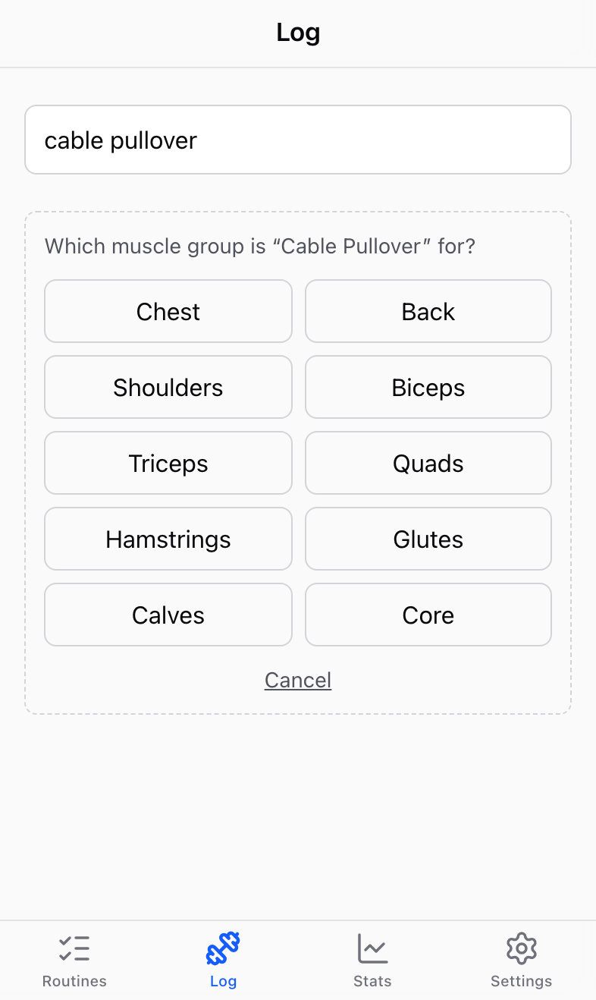</td>
  </tr>
  <tr>
    <td>Your recent exercises first, then about 85 more, grouped by muscle.</td>
    <td>Not there? Type it, pick a muscle group, add it.</td>
  </tr>
</table>

The app comes with about 85 common exercises (bench press, squat, curls and so
on), grouped by muscle group: Chest, Back, Shoulders, Biceps, Triceps, Quads,
Hamstrings, Glutes, Calves and Core.

Search matches words in any order, so "incline db" finds *Incline Dumbbell
Press*. If what you want isn't there, keep typing and tap **+ Add "…"**. A small
form opens with the name (fix it if you need to) and the muscle groups: pick one,
then tap **Add exercise** (or **Add to routine** when you're editing a routine).
Nothing is created until you tap that button, and **Cancel** backs out.

Custom exercises are private to you and marked "Custom". To **rename one, change
its muscle group or delete it**, go to **Settings → Custom exercises**, or tap
**Edit** next to "Custom" on the exercise's screen. Deleting one also deletes its
logged entries (it tells you how many first) and removes it from your routines.
Built-in exercises can't be edited or deleted.

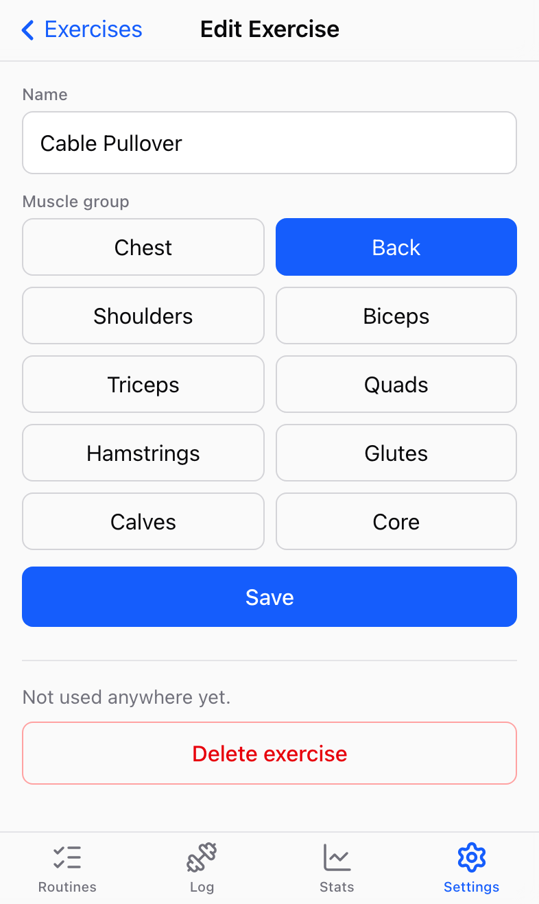

## Stats

<table>
  <tr>
    <td>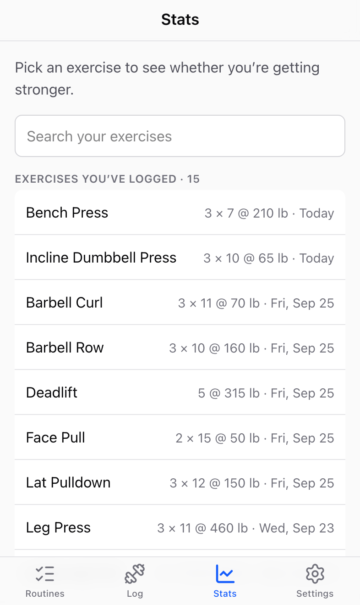</td>
    <td>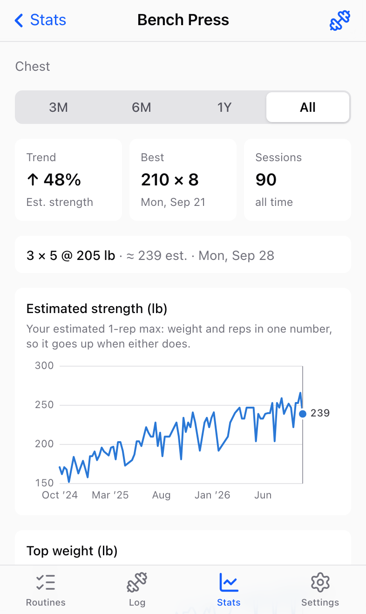</td>
    <td>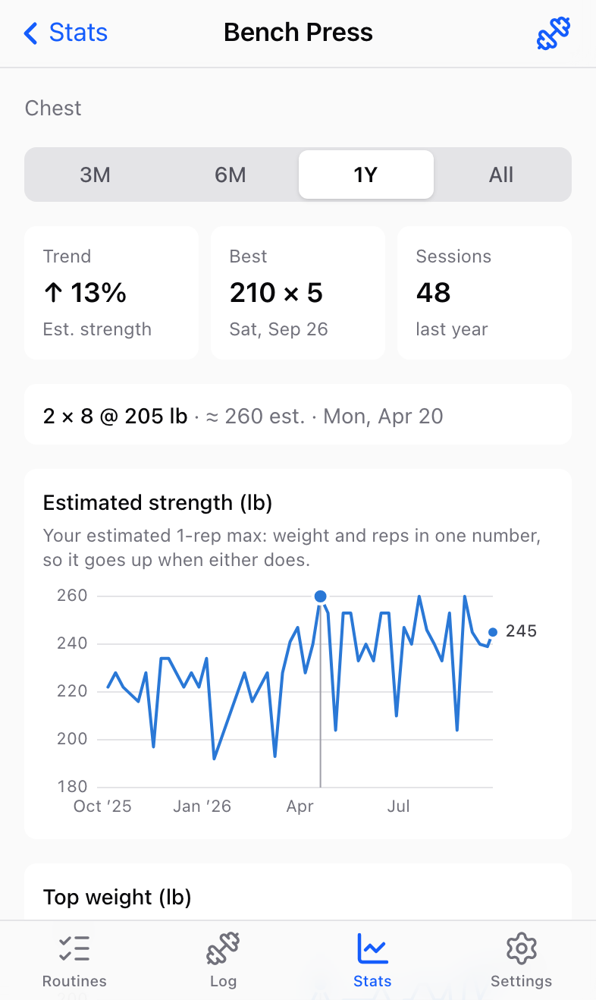</td>
    <td>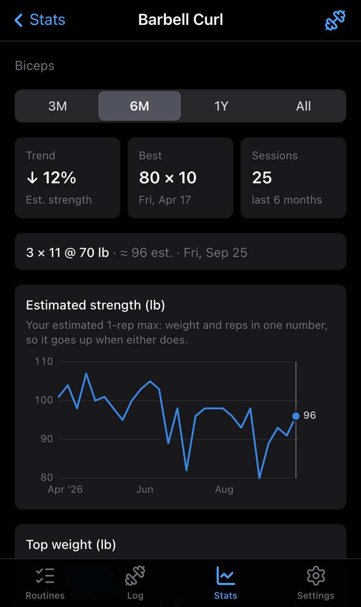</td>
  </tr>
  <tr>
    <td>Only exercises you've logged.</td>
    <td>Two years of bench press.</td>
    <td>Tap or drag on a chart to read a day.</td>
    <td>A downward trend (and dark mode).</td>
  </tr>
</table>

The **Stats** tab lists only the exercises you've logged (most recent first, with
what you did last), since those are the ones with something to show. Pick one,
or tap the chart icon while logging an exercise.
Choose a range (3 months, 6 months, 1 year or all) and you get:

- **Trend**: whether you're getting stronger (↑), holding steady (→ Flat) or
  weaker (↓) over that range, as a percentage. Changes under 2.5% count as
  flat. It's a best-fit line, so one great or bad day doesn't swing it.
- **Best**: your heaviest set in the range.
- **Sessions**: how many days you did the exercise.
- **Estimated strength** chart: your estimated one-rep max each day. It combines
  weight and reps into one number (weight × (1 + reps ÷ 30), the Epley formula),
  so *more reps at the same weight* shows up as progress. This is what the
  trend is based on.
- **Top weight** chart: the heaviest weight you lifted each day.

Tap or drag on either chart and the box above them shows that day's details,
like *2 × 8 @ 205 lb · ≈ 260 est. · Mon, Apr 20*. Gaps of more than four
weeks (a vacation, say) break the line rather than drawing across them.

## Settings and accounts

**Settings** shows the email you're signed in with, **Custom exercises** (to
rename or delete the ones you added), and **Sign out**.

Admins (set with `ADMIN_EMAILS`) also see **Access requests**, with a count of
people waiting. Each request shows the email, their note and when they asked, with
**Approve** and **Deny**. Approved people can create an account straight away.
You can change your mind later, as long as they haven't signed up yet.

Each person has their own routines, log and stats; nobody can see anyone else's.
The built-in exercise list is shared, but custom exercises are private.

## Good to know

- **Dates are your phone's dates.** "Today" is today where you are, and entries
  are stored as plain days, with no time or timezone.
- **Dark mode** follows your phone's setting.
- **No password reset yet.** It needs an email service; ask the owner if you're
  locked out.
- **Try it with data:** the owner can create a demo account with two years of
  made-up history (see [Demo data](../README.md#demo-data) in the README).
